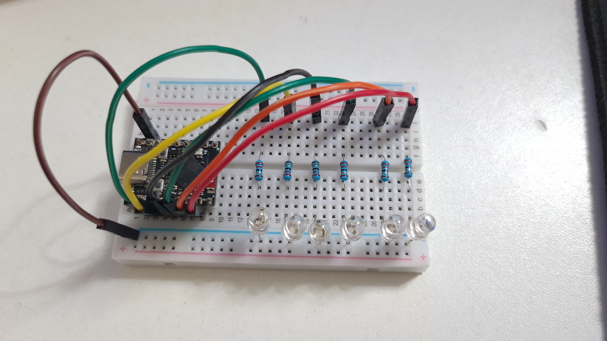
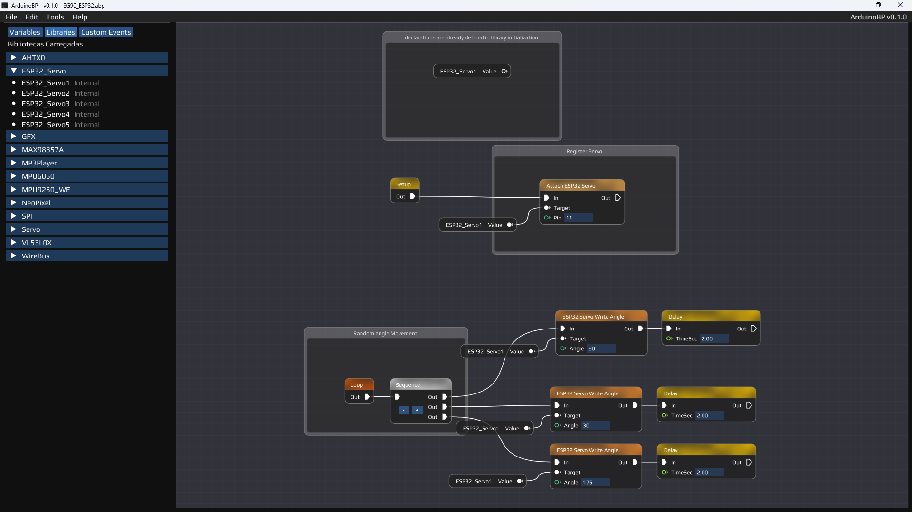

# ArduinoBP

ArduinoBP is a visual tool that lets you build Arduino code using a node-based system, kind of like Unreal Engine's Blueprints. Instead of writing code manually, you drag and connect nodes, and the C++ code is generated for you—ready to copy and paste into the Arduino IDE.

## What is this?

ArduinoBP was built to make Arduino development easier and more fun, especially for people who like to think visually. It supports everything from basic math and logic to sensors, MP3 playback, TFT displays, and more. You can even build your own custom libraries and extend the system however you want.

This project runs on top of LiteGraph.js and adds a ton of features.

**Image:**  


## How does it work?

1. You start by placing a `Setup` and `Loop` node.
2. Then you drag in other nodes like `Print`, `If`, `Add`, or sensor readers.
3. Connect them to define the logic visually.
4. Click "Generate Code" and it will spit out clean, ready-to-run C++ code.


## Node Highlights

Here are some node types you’ll find:

- **Flow Control:** Branch, DoOnce, ForLoop, While, Gate, FlipFlop, MultiGate
- **Math:** Add, Subtract, Multiply, Divide, Modulo (for Int, Float, Byte, and more)
- **Logic:** Equal, Not Equal, Greater, Less, etc.
- **Variables:** Int, Float, Bool, Byte, String, Color, Vector3 – including arrays (WIP)
- **Debugging:** Print, PrintCleanString (replaces line in Serial Monitor)
- **Sensors:** VL53L0X, MPU6050, MPU9250, MPU9262, and more (Any request to sensors you can ask on Discord, and follow actual request on Trello)

## Community

If you're working on a project, stuck on something, or just want to talk ideas, come hang out on Discord. We’re building a small but helpful community.
Additionally, you can report bugs or request features in dedicated channels.
I will respond to requests as they arise and I have time, you can follow the progress on Trello.

[](https://discord.com/invite/mxsfKku7JV)

[](https://trello.com/b/lSe6i005/arduinobp-roadmap)


## Support ArduinoBP

ArduinoBP is a labor of love, built with passion and countless hours of dedication.  
If this project has helped you in any way, consider supporting it — every bit of help keeps it alive and fuels the motivation to keep building and sharing.  
**Thank you for being part of this journey.**

[](https://www.paypal.com/donate/?hosted_button_id=RHHMMWMGAYZH8)


Anything helps and keeps the project going!

## Project Layout

This repo includes:

- ArduinoBP executable Files
- Libraries for things like MP3 playback, TFT drawing, sensors
- Example `.abp` graph files

## Requirements

- Arduino IDE
- A supported board (like Arduino Uno, ESP32-S3, etc.)
- If you want to customize, some knowledge of C++ or JS will help

---

This is still a work-in-progress and growing every day. If you want to contribute, test, or just chat, I’d love to hear from you!

# 📚 Documentation

Here you will find a collection of tutorials, usage examples, and guides to help you get the most out of **ArduinoBP**.

---

## 🔧 Getting Started

**Description:**  
You will still need the Arduino IDE to compile the code. ArduinoBP includes a tool to export `.ino` files.  
Make sure you have installed the necessary libraries corresponding to the `#include` statements in your code, just like you normally would when coding manually.

https://github.com/user-attachments/assets/c481eebe-5cf3-4ed1-8c6f-c7cc404ade27


---

## 🧠 Node System Overview

**Description:**  
Understand how the visual node system works, how nodes are connected, and how flow and data types interact to generate valid Arduino code.

---

ArduinoBP is inspired by the **Blueprint system from Unreal Engine**, where logic is built visually using connected nodes.

The system has been **adapted specifically for Arduino development**, meaning it follows the microcontroller execution model using two entry points:

- **`Setup` node:** Corresponds to Arduino's `setup()` function. Runs once at startup.
- **`Loop` node:** Corresponds to Arduino's `loop()` function. Runs continuously.

---

### 🔁 Flow System

The core execution logic uses **Flow pins and Flow links**, which control the order in which nodes are executed.

- **Flow Input**: Where execution enters the node.
- **Flow Output**: Where execution continues to the next node.

When you connect one node's Flow Output to another's Flow Input, you are **defining execution order**, similar to sequential lines of code.

Example:
```
[Setup] → [AHTBegin] → [AHTUpdate] → [PrintTemperature]
```
This sequence ensures each node is called in order during the program's `setup()`.

---

### 🔗 Data Pins

In addition to Flow pins, nodes can have **typed input and output pins** like `Int`, `Float`, `Bool`, or `String`.

- Data pins **transfer values**, not execution.
- You can connect outputs from one node to the inputs of another to pass values along the flow.

This allows combining logic like:
```
[Sensor Read] → [Float] → [Compare] → [Branch]
```

Together, the **Flow + Data** system allows ArduinoBP to visually express complete Arduino logic in a user-friendly and intuitive way.

---


## ⚙️ Setting Examples and Library

**Description:**  
Before you can use custom nodes or explore the examples, you need to tell ArduinoBP where to find your libraries and example files.

---

### 🔧 How to Set Paths

1. Open ArduinoBP.
2. From the **top menu**, click on **"Tool" > "Settings"**.
3. In the settings window, locate:
   - **Library Path** – this is where your custom libraries (`.h` files) are stored.
   - **Examples Path** – this is the folder containing your `.abp` project files.

Set each field to the correct folder on your system (e.g., `D:/ArduinoLibrary/` for libraries and `D:/ArduinoBPExamples/` for examples).  
Once set, these resources will be automatically loaded every time you open the editor.

---

### 🖼️ Interface

Below is a screenshot of the settings screen:


---

## ⚙️ Custom Nodes & Libraries

**Description:**  
Learn how to create your own custom nodes, import libraries, and expand ArduinoBP for any hardware.

ArduinoBP allows you to expand functionality by creating custom libraries that define new variable types and nodes.  
These libraries are automatically parsed at startup and become available in the editor.

### 🧩 How Custom Libraries Work

A custom library is a `.h` file placed in your `D:/ArduinoLibrary/` folder. ArduinoBP scans this folder and parses each file using a specific structure. Below is a breakdown using a real example for the **Adafruit AHTX0** sensor.

---

#### 🔸 Library Variables Block
```cpp
VAR: aht, Object, , DECL: Adafruit_AHTX0 aht;
VAR: aht_temp, Float, 0.0f;
VAR: aht_humidity, Float, 0.0f;
```

Each `VAR:` line defines a global variable used by the library:

- **Syntax:**  
  `VAR: name, type, default_value, [optional DECL override]`

- **Parameters:**  
  - `name`: internal name used in the code (must be unique).
  - `type`: variable type (e.g., `Float`, `Bool`, `Object`).
  - `default_value`: initial value. Leave blank if not needed.
  - `DECL:`: optional custom declaration, useful for objects.

- **Example:**
  ```cpp
  VAR: aht, Object, , DECL: Adafruit_AHTX0 aht;
  ```
  This declares:
  ```cpp
  Adafruit_AHTX0 aht;
  ```

  Another:
  ```cpp
  VAR: aht_temp, Float, 0.0f;
  ```
  This declares:
  ```cpp
  float aht_temp = 0.0f;
  ```

---

### 🧩 Defining Nodes

Each node is defined using the `NODE:` syntax:

```cpp
NODE: AHTBegin {
    Name = AHT Begin;
    InternalName = AHTBegin;
    Color = (100, 200, 255);
    Include = Adafruit_AHTX0.h;
    Description = "Initializes the AHT sensor";

    Input: Flow In;
    Output: Flow Out;
}
```

#### 🔹 Node Fields:

- `Name`: Display name in the editor.
- `InternalName`: Internal unique name.
- `Color`: RGB node color in the graph.
- `Include`: Header file(s) required.
- `Description`: Tooltip shown on hover.
- `Input` / `Output`: Define pins. Can be `Flow`, or typed pins like `Float`, `Bool`, etc.

---

### 🔧 CODE Block

Each node can include a code block that defines the actual C++ code ArduinoBP will inject during generation.

```cpp
CODE: AHTBegin
    aht.begin();
END_CODE
```

- The code **starts on the line immediately after** `CODE: <FunctionName>`  
- It **ends on the line right before** `END_CODE`
- Everything between those lines will be inserted as-is in the generated `.ino` file.

If the node is part of the **execution flow**, the code will be placed in the correct flow position (inside `setup()`, `loop()`, or another node chain).  
If the node is **output-only**, like `AHTGetTemperature`, the code must return a value expression:

```cpp
CODE: AHTGetTemperature
    aht_temp
END_CODE
```

This expression will be used wherever the node output is connected — for example, in another node's assignment or condition.

---


---

### 📌 Summary of AHT Nodes

| Node              | Purpose                                |
|-------------------|----------------------------------------|
| `AHTBegin`        | Initializes the sensor                 |
| `AHTUpdate`       | Updates temp and humidity values       |
| `AHTGetTemperature` | Returns the latest temperature       |
| `AHTGetHumidity`  | Returns the latest humidity            |

---

### 🧠 Custom Tips

- You can define as many variables as needed using `VAR:` and they are globally accessible.
- Use `DECL:` to create object instances or custom types.
- All nodes using the same variable set should be grouped in one file.
- You can add multiple `Include =` lines if needed; each will become a `#include` in the final `.ino`.

---

📁 Make sure your `.h` file is placed in the `D:/ArduinoLibrary/YourLibrary/` folder and named accordingly.  
Once loaded, the nodes and variables will be available automatically in the editor.


---


## 📤 Exporting & Uploading Code

**Description:**  
Once your node graph is ready, you can export it to a valid `.ino` file and upload it using the Arduino IDE.

---

### 📁 How to Export

1. Go to the **top menu** and select **"Export As..."** or press `Ctrl + I`.
2. Choose either:
   - A `.ino` file (inside a folder with the same name)
   - A folder to create a new `.ino` inside automatically

> 📌 If the `.ino` file or folder does not exist, ArduinoBP will create a folder with the same name as the `.ino`, as required by the Arduino IDE for proper compatibility.

---

### 🚀 Uploading the Code

After exporting:

1. Open the exported `.ino` file in the **Arduino IDE**
2. Make sure all required libraries (`#include`) are installed
3. Select the correct board and COM port
4. Click **Upload** to flash the code onto your Arduino

ArduinoBP generates code that is fully compatible with the Arduino IDE, so you can follow the usual steps for uploading based on your board (e.g., Uno, Mega, ESP32, etc.).


## 🧪 Example Projects

**Description:**  
ArduinoBP includes a set of curated example projects to help you get started quickly with real-world hardware.  
Each example showcases a specific sensor or component, with a ready-to-run node graph and the generated result.  
You'll find the board used, a screenshot of the blueprint graph, and a video showing the project in action.

- 📌 Important note: all the following examples were created in BETA 0.1.0, so there may be incompatibility with updated versions in the future, always pay attention to the examples included in the zip of the version used.

---

### 📺 AHT10 (Temperature & Humidity Sensor)

Reads temperature and humidity values from the AHT10 sensor and displays them via serial monitor.

- **Library Used:** `Adafruit_AHTX0.h`
- **Board:**  
  
- **Blueprint Graph:**  
  
- **Final Result:**  
[](https://youtu.be/rhwxZbCyeGM)

---

### 🖼️ GC9A01 (TFT Circular Display)

Displays animated graphics and text on a circular GC9A01 TFT screen using the Arduino GFX library.

- **Library Used:** `Arduino_GFX_Library.h`
- **Board:**  
  
- **Blueprint Graph:**  
  
- **Final Result:**  
  📹 [](https://youtu.be/ehu6qjgtwos)

---

### 📡 HC-SR04 (Ultrasonic Distance Sensor)

Measures the distance to nearby objects using an ultrasonic sensor and prints the result.

- **Library Used:** ArduinoBP default
- **Board:**  
  
- **Blueprint Graph:**  
  
- **Final Result:**  
[](https://youtu.be/YKVhoRsDeAk)

---

### 💡 LED Sequence

Blinks a series of LEDs in a programmed sequence using `ForLoop / WithDelay`.
This example shows one of the practical features that can be applied using the blueprint system, `ForLoop / WithDelay` contains a local delay, which does not interfere with the execution time of the main loop.

- **Library Used:** ArduinoBP default
- **Board:**  
  
- **Blueprint Graph:**  
  
- **Final Result:**  
[](https://youtu.be/_C-ZN5mHv9g)

---

### 🎵 MP3 Player (ESP32 + MAX98357A)

Plays MP3 audio files from SD card using the ESP32 with an I2S DAC (MAX98357A).
This demo demonstrates a custom library that works with more than one device at the same time, to make it easier to implement in a graph, without having to configure each device manually.

- **Library Used:**  `AudioFileSourceSD.h` `AudioGeneratorMP3.h` `AudioOutputI2S.h`
- **Board:**  
  
- **Blueprint Graph:**  
  
- **Final Result:**  
[](https://youtu.be/TgYfw-ICHds)

---

### 🌀 MPU-6050 (Gyroscope + Accelerometer)

Reads gyro and accelerometer data and prints the values to the serial monitor.

- **Library Used:** `MPU6050.h`
- **Board:**  
  
- **Blueprint Graph:**  
  
- **Final Result:**  
[](https://youtu.be/738FoGOJJqI)

---

### 🌈 NeoPixel Animation

Creates colorful LED animations using an addressable NeoPixel strip.
In this example, the standard LED connected to pin 48 (ESP32S3-SuperMini) was used.
This example shows how you can reuse functions already created to reduce the size of the graph (improvements are intended for future versions)

- **Library Used:** `Adafruit_NeoPixel.h`
- **Board:**  
  
- **Blueprint Graph:**  
  
- **Final Result:**  
[](https://youtu.be/bwQ8pjkpdAs)

---

### 🧪 Sensor + Vibration Motor

Activates a vibration motor based on input from a sensor (e.g., light or pressure).

- **Library Used:** ArduinoBP default
- **Board:**  
  
- **Blueprint Graph:**  
  
- **Final Result:**  
[](https://youtu.be/wJ84QlkeFmA)

---

### ⚙️ SG90 Servo with ESP32

Rotates a servo motor smoothly using interpolation based on sensor input or logic.

- **Library Used:** `ESP32Servo.h`
- **Board:**  
  
- **Blueprint Graph:**  
  
- **Final Result:**  
[](https://youtu.be/TY-3DgRyc9A)

---

### 🔆 TEMT6000 Light Sensor

Reads ambient light levels and displays the value on the serial monitor.

- **Library Used:** ArduinoBP default
- **Board:**  
  
- **Blueprint Graph:**  
  
- **Final Result:**  
[](https://youtu.be/z8tu8lGXSHY)